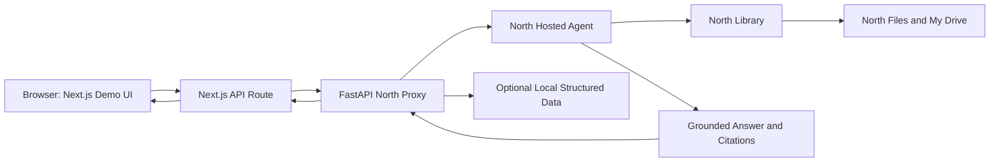
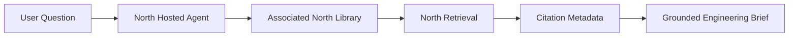

# EOWI Demo — System Architecture

System design for the End-of-Well Intelligence demo after the North platform pivot. North owns the agent runtime and document retrieval; the local app owns the demo UI, secure proxying, and optional fallback behavior.

See [techstack.md](techstack.md) · [datamodel.md](datamodel.md) · [uiux.md](uiux.md) · [north-integration.md](north-integration.md)

---

## System Diagram



## Design Principles

- **North-first runtime**: the v1 target agent runs on Cohere North, not inside the local FastAPI service.
- **North-owned retrieval**: PDF ingestion, text extraction, chunking, embedding, indexing, and document retrieval are owned by North Files and Libraries.
- **Thin local backend**: FastAPI remains as a secure proxy/orchestrator for auth, request shaping, streaming adaptation, local structured tools, and fallback mode.
- **No low-level retrieval in the demo path**: LanceDB, BM25, and local embedding scripts are no longer the primary path unless North APIs are blocked.
- **Presenter-ready UI stays local**: the Next.js UI, tool timeline, citation chips, and PDF/citation affordances remain the demo surface.

---

## North API Boundary

North is a REST API at `https://{north-hostname}/api` and requires bearer authentication for programmatic calls. The backend proxy must keep North tokens server-side and must not expose them to the browser.

North platform responsibilities:

- Store uploaded PDFs and related artifacts in My Drive.
- Create and sync Libraries from existing artifacts or uploaded files.
- Run the hosted EOWI agent.
- Retrieve from associated Libraries.
- Return grounded answers and citation metadata.

Local responsibilities:

- Export and curate the Volve subset before ingestion.
- Send curated PDFs to North Library ingestion.
- Store North IDs needed by the demo (`agent_id`, `library_id`, file/artifact IDs).
- Adapt North responses to the existing UI event shape.
- Preserve local mock/fallback mode for offline development.

---

## Data Acquisition And Library Ingestion

### Source

Databricks Marketplace: `/Volumes/equinor_asa_volve_data_village/public/volve`

Registered access (May 2026). Fallback: [data.equinor.com](https://data.equinor.com) via azcopy.

### Local Curation

`scripts/fetch_volve_databricks.py` continues to copy the v1 subset into local storage and preserve source path metadata. The local output becomes a staging area for North Library ingestion, not the final retrieval index.

### North Library Creation

North supports two library creation paths:

- Create a library from existing My Drive artifacts with `POST /v1/libraries`.
- Create a library from uploaded files with `POST /v1/libraries/jobs`, then poll `GET /v1/libraries/jobs/{job_id}` until the job completes and returns a `library_id`.

Sprint 3 should use the upload-job path for curated demo PDFs unless the files already exist in My Drive.

### Ingestion Success Criteria

- [ ] Curated F-11 demo documents can be uploaded or attached to a North Library.
- [ ] North returns a completed library job with a stable `library_id`.
- [ ] Failed files are visible through job status or library status fields.
- [ ] The created library can be associated with the EOWI North agent.
- [ ] The demo can ask a question and receive grounded citations from North.

---

## Retrieval Pipeline

Primary retrieval path:



The local app no longer builds or owns retrieval chunks, embeddings, LanceDB tables, or BM25 indexes for the primary demo path. North Libraries provide the indexed retrieval substrate.

Fallback retrieval path:

- Local mock corpus and deterministic retrieval may remain for CI, offline demos, and development when North credentials are unavailable.
- Fallback responses must be clearly treated as mock/local mode.

---

## Agent Architecture

### North Hosted Agent

The EOWI agent should be created and configured in North with:

- A drilling-specific name and description.
- A preamble that preserves the existing engineering answer policy.
- The selected North model for agent reasoning.
- A North Library tool or hosted tool configuration that points to the EOWI Library.
- Optional custom function tools for structured well metadata if North custom tools are available and suitable.

### FastAPI Proxy

FastAPI remains in the runtime, but its role changes:

- Accept the existing frontend `/chat` request shape.
- Attach North authentication server-side.
- Call the North-hosted agent.
- Adapt North events/responses into the current SSE stream used by the UI.
- Optionally serve local structured-data tools or fallback answers.
- Hide North-specific auth and instance configuration from the browser.

### Structured Data

Formation tops, well headers, and offset well metadata may remain local until North tool/function support is validated. If North-hosted agents can call custom function tools for these records, Sprint 3 should move structured tools behind North as well.

---

## Streaming And UI Contract

The existing UI expects SSE events:

| Type | Payload |
|---|---|
| `thinking` | Agent progress or planning text |
| `tool_call` | Tool name and params |
| `tool_result` | Tool result summary |
| `final` | Final verified brief text and source citations |
| `warning` | Recoverable issue |

Sprint 3 must map North chat/agent events into this UI contract or update the UI contract explicitly. The preferred path is adapter compatibility so the current demo UI remains stable.

---

## Project Structure

```text
og-eowi/
├── docker-compose.yml
├── data/                    # local staging and fallback data
├── scripts/
│   ├── fetch_volve_databricks.py
│   ├── north_library_ingest.py      # planned Sprint 3
│   └── wells.yaml
├── backend/
│   └── app/                 # FastAPI proxy + fallback mode
├── frontend/                # Next.js UI, SSE proxy, PDF/citation UI
└── eval/
    └── questions.yaml
```

Existing local indexing scripts remain historical scaffolding until either removed or repurposed as fallback tooling.

---

## Build Phases

| Phase | Deliverable |
|---|---|
| Sprint 1 | Local demo foundation, mock corpus, CI, pnpm/uv tooling |
| Sprint 2 | North platform pivot specs, API contract research, go/no-go checklist |
| Sprint 3 | North Library ingestion, North-hosted agent, backend proxy integration |
| Sprint 4 | UI adaptation for North citations and streaming semantics |
| Sprint 5 | Eval, dry runs, fallback story, internal review |

See [prd.md](prd.md) success criteria and [demoguide.md](demoguide.md) rehearsal checklist.
