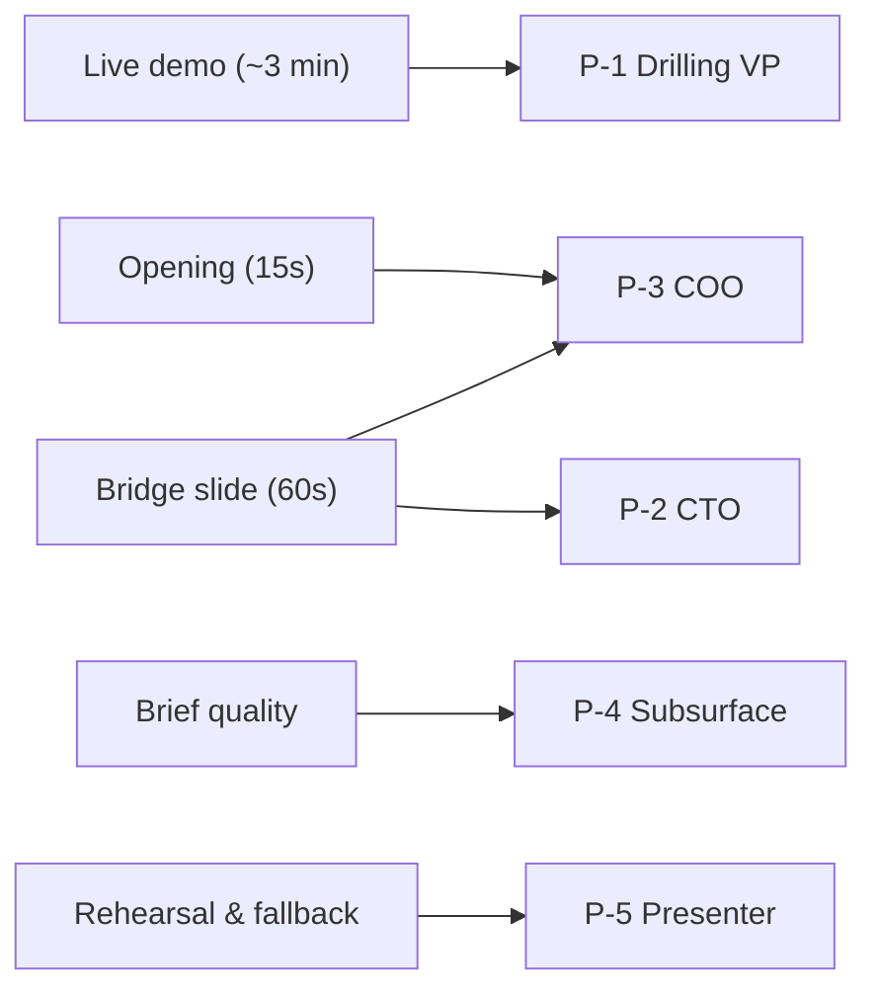

# EOWI Demo — Personas

Personas for the End-of-Well Intelligence demo. Each lists goals, frustrations, success criteria, and how v1 serves them.

## Persona index

| ID | Name (archetype) | Priority | Role |
|---|---|---|---|
| P-1 | Derek the Drilling VP | **Primary** | VP Drilling / Head of Drilling Operations — economic buyer |
| P-2 | Sarah the CTO | Secondary | Chief Technology Officer — integration & security influencer |
| P-3 | Marcus the COO | Secondary | Chief Operating Officer — ROI & operational risk influencer |
| P-4 | Elena the Subsurface Lead | Credibility | Head of Subsurface / Chief Geologist — domain authenticity check |
| P-5 | Alex the Presenter | Internal | Cohere sales / solutions engineer delivering the demo |

---

## P-1 — Derek the Drilling VP (Primary)

**Archetype:** VP Drilling at a mid-size E&P operator. 25 years in drilling. Has lost two senior superintendents to retirement in the last 18 months.

**Context:**

- Owns drilling budget and campaign planning across 3–8 rigs
- Trusts DDR/EOWR documents — his QA process already audits them
- Skeptical of "AI chatbots" but open to tools that reduce engineering hours
- Often in the room with CTO and COO when evaluating new technology

**Goals:**

- Compress weeks of report review into minutes before the next well spud
- Capture retiring superintendents' lessons without a multi-year knowledge-management project
- Trust that AI output is auditable — every claim traceable to source

**Frustrations:**

- 40,000+ PDFs nobody reads end-to-end
- Offset-well lessons learned inconsistently applied
- Junior engineers lack context on why past wells had problems
- "RAG demos" that return document lists, not engineering judgments

**Success criteria (5-minute demo):**

- Sees three concrete, severity-rated findings from F-11 with citations
- Clicks a citation and lands on the exact DDR page with highlighted text
- Believes the "design vs. execution" judgment required real reasoning, not keyword search
- Leaves thinking: *"We should pilot this on one field before the next campaign"*

**Primary demo moments:** §2.3 first question, §2.4 aha question, §2.5 citation drill-down

---

## P-2 — Sarah the CTO (Secondary — Pattern A)

**Archetype:** CTO at same operator. Responsible for data platform, security, and integration architecture.

**Context:**

- Has heard "we need to consolidate the data lake first" too many times
- Evaluates whether new tools fit VPC / private deployment models
- Watches the live demo but her decision moment is the bridge slide

**Goals:**

- Understand integration path without a 12-month data consolidation project
- Confirm the stack is not exotic (no Kubernetes requirement for POC)
- See audit trail / transparency in agent reasoning

**Frustrations:**

- AI vendors who require ripping out existing EDM / OpenWells / SharePoint
- Black-box models with no citation trail
- Demos that only work on the vendor's laptop

**Success criteria:**

- Bridge slide maps each tool to a plausible adapter over their stack (EDM, OpenWells, OSDU)
- Tool-call timeline visible during live demo = audit trail narrative
- Docker Compose cold-laptop story = deployable in their VPC

**v1 serve pattern:** Opening nod minimal; **§2.6 bridge slide (60s)** is her primary beat. No separate live UI path.

---

## P-3 — Marcus the COO (Secondary — Pattern A)

**Archetype:** COO overseeing upstream operations. Thinks in risk, cycle time, and FTE leverage.

**Context:**

- Cares about operational risk from repeated drilling mistakes
- Asks "what's the ROI?" but won't sit through engineering detail
- Influences budget alongside Derek (P-1)

**Goals:**

- Reduce repeat NPT events across the field
- Extend effective capacity of existing drilling engineering team
- See risk visibility, not just search

**Frustrations:**

- Lessons learned trapped in individual wells, not applied field-wide
- Knowledge loss from retirements treated as HR problem, not ops problem

**Success criteria:**

- Opening line lands: *"40,000 reports, superintendent retires next year"*
- Structured brief with severity ratings reads as risk visibility
- Close line: *"Same agent across your full field history tomorrow"*

**v1 serve pattern:** **§2.1 opening (15s)** + **§2.7 close (15s)** + bridge slide ROI framing. Live demo stays VP-focused.

---

## P-4 — Elena the Subsurface Lead (Credibility)

**Archetype:** Head of Subsurface / Chief Geologist. Validates that the agent understands formations, depths, and well context.

**Context:**

- Will notice if the agent confuses MD/TVD, misnames formations, or uses vague language
- Not the economic buyer but can veto if output reads as "generic AI"

**Goals:**

- Correct formation terminology (Hugin, Heather, Skagerrak)
- Structured tools return authoritative depth data before narrative search

**Frustrations:**

- AI that says "potential well problem at depth" instead of "differential sticking in Hugin sands at 2,950m MD"

**Success criteria:**

- Formation tops tool returns correct TVD/MD for Hugin on F-11
- Brief uses precise subsurface vocabulary from system prompt

**v1 serve pattern:** Credibility embedded in demo output quality; no separate subsurface demo path.

---

## P-5 — Alex the Presenter (Internal)

**Archetype:** Cohere solutions engineer or sales technical lead delivering the demo.

**Goals:**

- Deliver scripted demo in 4m15s without surprises
- Handle one off-script question gracefully
- Fall back to recorded run if Cohere API hiccups

**Success criteria:**

- 5+ dry runs without failure
- Docker Compose starts on clean laptop in under 10 minutes
- Knows 3 rehearsed weird questions and fallback responses

See [demoguide.md](demoguide.md) for full script and checklist.

---

## Audience prioritization (v1)

Future: dedicated CTO security one-pager and COO ROI slide — see [roadmap.md](roadmap.md).
