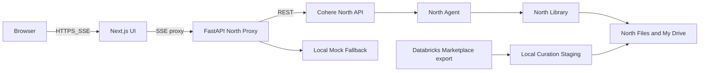

# EOWI Demo — Tech Stack

Technology choices for the End-of-Well Intelligence demo. Unlike other specs, this document names specific tools because they are explicit product and demo requirements.

See [architecture.md](architecture.md) for how components connect.

## Architectural overview



Two-process local runtime remains **Next.js** (UI) + **FastAPI** (North proxy), but the primary agent and retrieval runtime moves to **Cohere North**.

## Cohere North Platform

| Component | Choice | Rationale |
|---|---|---|
| Agent runtime | North Agents | Hosted agent runtime for reasoning, tool use, and library-grounded responses |
| Document ingestion | North Files / My Drive | Stores curated PDFs and files before Library sync |
| Retrieval substrate | North Libraries | Handles document sync, extraction, chunking, embedding, indexing, and retrieval |
| API access | North REST API | Programmatic access to agents, libraries, files, and chat through bearer-authenticated calls |
| Auth boundary | FastAPI proxy | Keeps North tokens server-side and preserves the current frontend contract |

## LLM & Cohere models

| Role | Model | Notes |
|---|---|---|
| North agent reasoning + tool use | North-supported Command A family model | Primary demo model configured on the hosted agent |
| PDF/document retrieval | North Libraries | Model and indexing details are platform-managed |
| Local fallback | Existing mock corpus and deterministic backend path | Dev/CI/offline mode only |

**Why Command A:** Tool-use is first-class; strong grounded RAG; Cohere-native story for the demo.

**Why North Libraries:** North absorbs the low-level document retrieval work that would otherwise require local chunking, embedding, LanceDB, BM25, and rerank orchestration.

## Retrieval & storage

| Component | Choice | Rationale |
|---|---|---|
| Primary document store | North Files / My Drive | Stores uploaded Volve PDFs and artifacts |
| Primary retrieval index | North Libraries | Platform-managed extraction, sync, indexing, and retrieval |
| Structured metadata | Local JSON/DuckDB fallback until North tools are validated | Well headers, formation tops, and offsets may remain local temporarily |
| Source PDFs | North Files plus optional local curated copies | North is source of truth for retrieval; local copies support fallback and presenter inspection |
| Local vector/BM25 stack | Deprecated from primary path | Retained only as scaffold/fallback while North integration is developed |

## Backend

| Component | Choice | Rationale |
|---|---|---|
| Backend service | FastAPI + Uvicorn | Thin proxy/orchestrator for North auth, request shaping, streaming adaptation, and fallback mode |
| North client | REST API initially; SDK acceptable if it improves auth and streaming handling | Keeps implementation close to documented API contracts |
| Local agent loop | Fallback only | Useful for offline demos and CI, not the primary runtime |
| Structured tools | Local or North function tools | Final placement depends on North custom tool support validation |

## Frontend

| Component | Choice | Rationale |
|---|---|---|
| Framework | Next.js 14 App Router | Matches project conventions; RSC + streaming |
| Styling | TailwindCSS + shadcn/ui | Enterprise engineering aesthetic |
| PDF viewer | react-pdf (pdfjs-dist) | De-facto standard; bbox overlay support |
| Streaming | SSE via API route proxy | Preserves current tool timeline + brief streaming while backend adapts North events |

## Data acquisition

| Component | Choice | Rationale |
|---|---|---|
| Primary source | Databricks Marketplace volume `/Volumes/equinor_asa_volve_data_village/public/volve` | Registered access |
| Export | `scripts/fetch_volve_databricks.py` | Copy Option B subset to local staging before North upload |
| North ingestion | `POST /v1/libraries/jobs` or `POST /v1/libraries` | Upload files into a new Library or attach existing My Drive artifacts |
| Fallback source | data.equinor.com + azcopy | If Databricks export fails |

**Runtime:** No Databricks dependency during demo. North Library and hosted agent availability become runtime dependencies unless fallback mode is enabled.

## Deployment

| Component | Choice | Rationale |
|---|---|---|
| Local / demo | Docker Compose | Runs frontend and proxy locally; North agent/library run on Cohere North |
| Optional cloud | Vercel (frontend) + Fly.io / Railway (backend) | Post-v1 if needed |

## Deliberately NOT in the stack

| Rejected | Why |
|---|---|
| LangChain / LlamaIndex / CrewAI / LangGraph | Overhead for 5 tools + linear loop |
| Pinecone / Weaviate / Qdrant | North Libraries own retrieval |
| LanceDB / bm25s as primary runtime | Replaced by North Libraries |
| Postgres (v1) | Structured metadata can remain local until North tool strategy is validated |
| Snowflake (v1) | Scale story on bridge slide only |
| ocrmypdf / Tesseract (v1) | North Library ingestion is preferred; local OCR becomes fallback only |
| Authentication (v1) | Controlled demo environments only |
| Kubernetes | Single VM deployable requirement |

## Environment variables

```bash
NORTH_BASE_URL=https://demo.north.cohere.com/api
NORTH_BEARER_TOKEN=         # server-side only; never expose to browser storage
NORTH_AGENT_ID=             # created North agent
NORTH_LIBRARY_ID=           # created EOWI document library
DATA_DIR=./data             # local staging and fallback data
```

## Two-service rationale

The Python backend remains because:

1. North tokens must stay server-side.
2. The current UI expects a stable SSE endpoint.
3. North event/citation payloads may need adaptation before reaching the browser.
4. Local fallback mode and structured-data helpers still benefit from Python.

Collapsing to Next.js-only runtime is roadmap — see [roadmap.md](roadmap.md).
