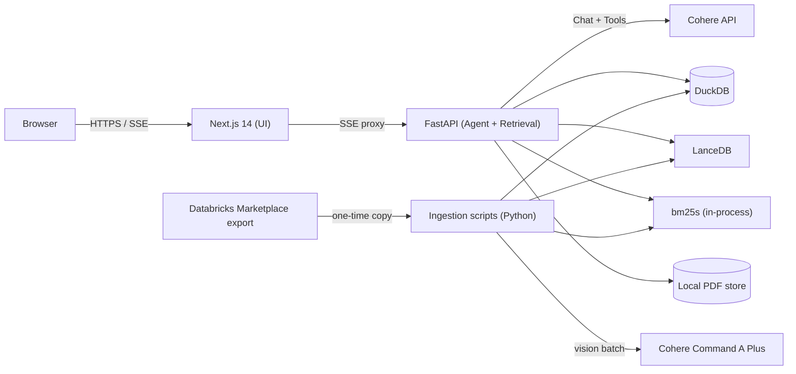

# EOWI Demo — Tech Stack

Technology choices for the End-of-Well Intelligence demo. Unlike other specs, this document names specific tools because they are explicit product and demo requirements.

See [architecture.md](architecture.md) for how components connect.

## Architectural overview



Two-process runtime: **Next.js** (UI) + **FastAPI** (agent, retrieval, tools). Python owns ingestion, indexing, and agent loop because the data pipeline and Cohere Python SDK are mature for this workload.

## LLM & Cohere models

| Role | Model | Notes |
|---|---|---|
| Agent reasoning + tool use | `command-a-03-2025` (or latest Command A at build time) | Primary demo model |
| Vision PDF extraction | `command-a-plus-05-2026` | Batch ingestion only — scan/image PDFs |
| Embeddings | `embed-v4.0` (1024-dim) | `search_document` for index; `search_query` for retrieval |
| Reranking | `rerank-v3.5` | Top-80 merged → top-8 |
| Cost-controlled fallback | `command-r-plus-08-2024` | Dev/eval runs |

**Why Command A:** Tool-use is first-class; strong grounded RAG; Cohere-native story for the demo.

**Why Command A Plus for vision:** Scan/image Volve DDRs (~20% of corpus) need OCR. Vision extraction at ingestion produces structured text + layout blocks without a separate Tesseract pipeline. **Not called at query time** — extracted text is indexed like native PDF text.

## Retrieval & storage

| Component | Choice | Rationale |
|---|---|---|
| Vector DB | LanceDB | Embedded, no separate service, HNSW default |
| BM25 | bm25s | In-process Python, lightweight |
| Structured DB | DuckDB | Single-file, zero-install, SQL portable to Postgres/Snowflake |
| Source PDFs | Local filesystem | `data/curated/pdfs/{doc_id}.pdf` |

## Backend

| Component | Choice | Rationale |
|---|---|---|
| Agent service | FastAPI + Uvicorn | Async, SSE streaming, ~200 LOC hand-rolled agent loop |
| Agent framework | **None** | Five tools + linear loop; frameworks add demo debug surface |
| PDF text extraction | pdfplumber (primary) | Preserves char bboxes and layout for highlights |
| PDF fallback parser | PyMuPDF | Secondary text path |
| Vision extraction | Command A Plus via Cohere SDK | Scan PDFs at ingestion — see [architecture.md](architecture.md#stage-1-text--layout-extraction) |

## Frontend

| Component | Choice | Rationale |
|---|---|---|
| Framework | Next.js 14 App Router | Matches project conventions; RSC + streaming |
| Styling | TailwindCSS + shadcn/ui | Enterprise engineering aesthetic |
| PDF viewer | react-pdf (pdfjs-dist) | De-facto standard; bbox overlay support |
| Streaming | SSE via API route proxy | Tool timeline + brief streaming |

## Data acquisition

| Component | Choice | Rationale |
|---|---|---|
| Primary source | Databricks Marketplace volume `/Volumes/equinor_asa_volve_data_village/public/volve` | Registered access |
| Export | `scripts/fetch_volve_databricks.py` | Copy Option B subset to `data/raw/` |
| Fallback source | data.equinor.com + azcopy | If Databricks export fails |

**Runtime:** No Databricks dependency during demo.

## Deployment

| Component | Choice | Rationale |
|---|---|---|
| Local / demo | Docker Compose | Cold-laptop criterion; backend + frontend + data volume |
| Optional cloud | Vercel (frontend) + Fly.io / Railway (backend) | Post-v1 if needed |

## Deliberately NOT in the stack

| Rejected | Why |
|---|---|
| LangChain / LlamaIndex / CrewAI / LangGraph | Overhead for 5 tools + linear loop |
| Pinecone / Weaviate / Qdrant | Extra service, no demo benefit |
| Postgres (v1) | DuckDB sufficient; portable later |
| Snowflake (v1) | Scale story on bridge slide only |
| ocrmypdf / Tesseract (v1) | Replaced by Command A Plus vision extraction |
| Authentication (v1) | Controlled demo environments only |
| Kubernetes | Single VM deployable requirement |

## Environment variables

```bash
COHERE_API_KEY=           # Required at runtime
COHERE_AGENT_MODEL=command-a-03-2025
COHERE_VISION_MODEL=command-a-plus-05-2026
DATA_DIR=./data             # Mounted in Docker Compose
```

## Two-service rationale

Python backend exists because:

1. Ingestion pipeline is Python-native (pdfplumber, LanceDB, DuckDB, bm25s)
2. Agent loop and retrieval share the same process as index readers
3. Cohere Python SDK is mature for chat + embed + rerank + vision
4. Next.js stays thin — streaming UI, PDF viewer, citation chips only

Collapsing to Next.js-only runtime is roadmap — see [roadmap.md](roadmap.md).
