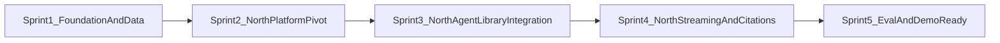

# EOWI Demo — Master Sprint Plan

This sprint plan sequences implementation of the End-of-Well Intelligence demo from the specifications in `specs/`.

## Vision

Build a presenter-ready, cold-laptop deployable agentic demo that answers drilling questions about Volve well 15/9-F-11 and five offset wells with grounded, cited engineering briefings, visible tool-call trace, and PDF citation drill-down.

## Cadence

- Sprint length: approximately 1 week
- Team: solo developer + AI assistant
- Sprint artifacts: `sprint_N_tasks.md`, `sprint_N_testplan.md`, optional updates/report files
- Central logs: `backlog.md`, `tech_debt.md`, `bug_swatting.md`

## Sprint Dependency Graph

## Sprint Summaries

| Sprint | Focus | Primary spec anchors |
|---|---|---|
| 1 | Foundation, Docker Compose, Databricks export script, extraction/parsing, mock corpus | `specs/architecture.md`, US-1.1 to US-1.4 |
| 2 | North platform architecture/spec pivot, API contract research, go/no-go checklist | `specs/architecture.md`, `specs/techstack.md`, `specs/datamodel.md`, `specs/north-integration.md` |
| 3 | North Library ingestion, North-hosted EOWI agent, FastAPI proxy integration | US-1.3 to US-3.3, `specs/north-integration.md` |
| 4 | North streaming adaptation, citation mapping, PDF/source UI behavior | `specs/uiux.md`, US-4.1 to US-4.2 |
| 5 | Eval harness, Docker hardening, dry runs, bridge slide, internal review | `specs/demoguide.md`, US-4.3 to US-5.2 |

## Success Metrics

| Metric | Target |
|---|---|
| Demo runtime | 5 minutes or less, target 4:15 |
| Query latency | 30 seconds or less |
| Eval category 1 | 90%+ pass |
| Eval categories 2-3 | 80%+ pass |
| Cold laptop setup | 10 minutes or less |
| Dry runs | 5 consecutive clean runs |

## North Pivot Notes

Sprint 2 replaces the planned local indexing implementation with a North platform migration design. DuckDB, LanceDB, BM25, and local chunking may remain as fallback or historical scaffold, but they are not the primary v1 runtime path.

Sprint 3 begins only after the Sprint 2 go/no-go checklist confirms:

- North Library creation from uploaded curated files is feasible.
- North agent configuration can reference the EOWI Library.
- The backend can call North with server-side authentication.
- North answer and citation payloads can be mapped to the current UI or to an explicitly revised UI contract.
